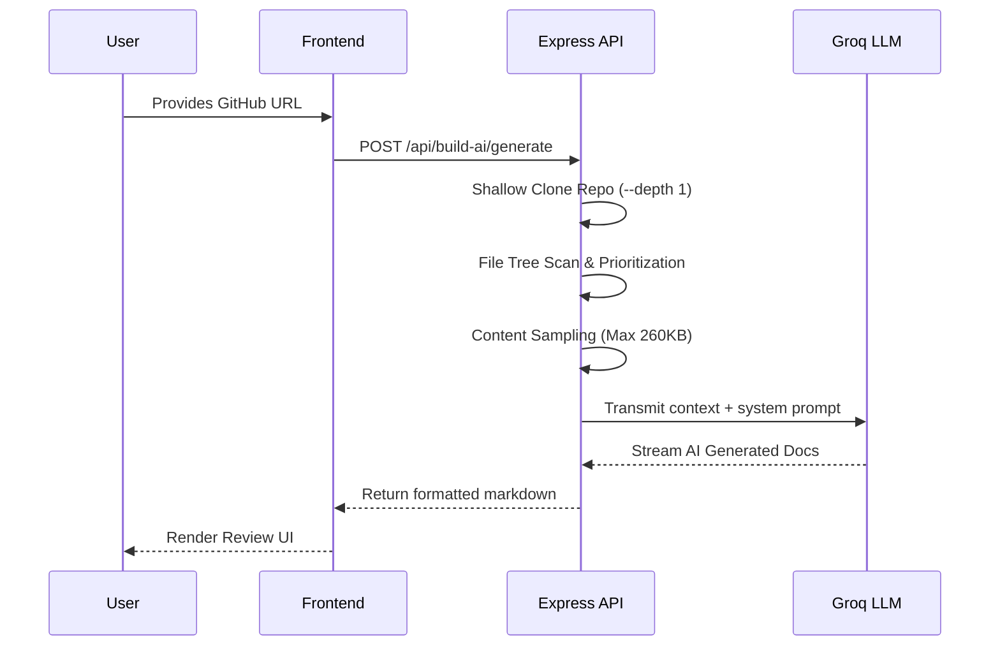

# 🏗️ mdfmt Architecture Documentation

Welcome to the **mdfmt (README Studio)** architecture guide. This document provides a deep dive into the system design, core pipelines, and state management strategies used across the application.


## 📦 System Overview

mdfmt is built as a **TypeScript Monorepo**, ensuring seamless types across both the frontend React client and the backend Express server. 

### Frontend (`frontend/`)
The frontend is built for performance and instant reactivity:
- **React 19.2** with Concurrent rendering.
- **Vite 7.3** for lightning-fast HMR and optimized builds.
- **Tailwind CSS 3.4** handles all styling, including a streamlined dark mode strategy using the `dark:` variant.
- **TipTap/ProseMirror** serves as the backbone for the WYSIWYG editor.

### Backend (`backend/`)
A lightweight API built to handle intensive tasks such as repository cloning and LLM generation:
- **Express 5.2** handles API requests.
- **Prisma** interacts securely with any configured databases (if enabled).
- **Groq LLaMA 3.3-70B** integration performs complex documentation generation and Diagram reasoning.

---

## 🔄 Core Data Flow Pipelines

### 1. Editor State Pipeline

The editor strictly follows a unidirectional data flow to prevent desync between the visual representation and the underlying raw Markdown.

```mermaid
graph LR
    A[TipTap Editor\n(ProseMirror)] -->|HTML onUpdate| B[Turndown.js\nGFM Parser]
    B -->|Markdown| C[Zustand\nuseDraftStore]
    C -->|Persists| D[localStorage]
    C -->|Renders| E[Output Panel\nCode/Preview]
```

**Key Steps:**
1. The user types into the rich text editor. TipTap emits a clean HTML string.
2. The HTML is processed synchronously by a customized instance of `TurndownService` configured for GitHub-Flavored Markdown (GFM).
3. The resulting Markdown is pushed to the global `useDraftStore`.
4. The output panel uses `react-markdown` to render the GFM.

### 2. AI Documentation Generator Pipeline

The AI agent parses full Git repositories into documentation using a multi-step job queue approach.



### 3. Diagram Studio Pipeline

The newly introduced Diagram Studio turns natural language into interactive Mermaid graphs.

1. **User Prompt:** "A node backend talking to a postgres database."
2. **Backend Execution:** POST `/api/build-ai/diagram` sends the prompt to the LLaMA model, strictly enforcing a valid Mermaid JS block return without markdown code backticks.
3. **Frontend Rendering:** The client parses the Mermaid output and renders it directly in the preview pane using `mermaid.run()`.

---

## 🧠 State Management (Zustand)

Instead of prop-drilling or bulky Redux setups, mdfmt relies entirely on three highly-focused Zustand stores:

1. **`useDraftStore`**: Handles the editor's content. Automatically syncs HTML and Markdown to `localStorage`.
2. **`useThemeStore`**: Toggles a `dark` class on the `<html>` root node, providing seamless transitions between dark and light modes.
3. **`useAuthStore`**: Syncs heavily with Firebase's `onAuthStateChanged` hook to persist secure sessions across tabs and browser restarts.

---

> [!TIP]
> **Extending the Project:** If you want to add a new page (e.g., a Snippet Library), add the route to `App.tsx`, build the layout in `src/pages/`, and connect any needed AI logic through the existing `services/aiService.ts` in the backend!
